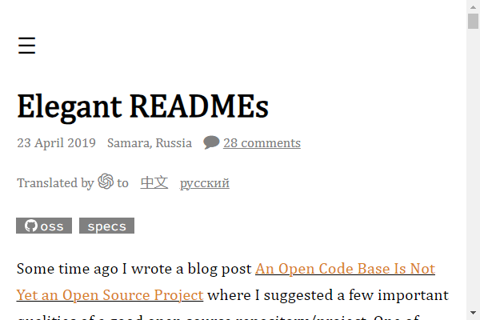
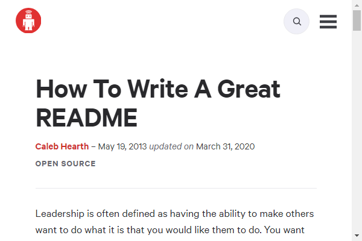
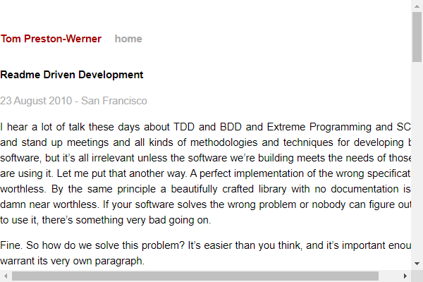
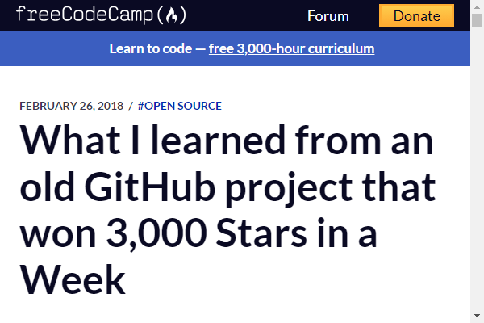

---
hide:
  - navigation
  - toc
---

# Articles

??? example "["Elegant READMEs"](https://www.yegor256.com/2019/04/23/elegant-readme.html)  *Yegor Bugayenko*"
    

??? example "["How To Write A Great README"](https://thoughtbot.com/blog/how-to-write-a-great-readme)  *Caleb Thompson (thoughtbot)*"
    

??? example "["Readme Driven Development"](https://tom.preston-werner.com/2010/08/23/readme-driven-development.html)  *Tom Preston-Werner*"
    

??? example "["Top ten reasons why I won’t use your open source project"](https://changelog.com/posts/top-ten-reasons-why-i-wont-use-your-open-source-project)  *Adam Stacoviak*"
    

??? example "["What I learned from an old GitHub project that won 3,000 Stars in a Week"](https://www.freecodecamp.org/news/what-i-learned-from-an-old-github-project-that-won-3-000-stars-in-a-week-628349a5ee14/)  *KyuWoo Choi*"
    
