---
hide:
  - navigation
---

# Examples

Elements in beautiful READMEs include, 
but are not limited to: images, screenshots, 
GIFs, text formatting, etc.

??? example "[aimeos/aimeos-typo3](https://github.com/aimeos/aimeos-typo3#readme) Project logo. Clear description of what the project does. Demo screenshot. TOC for easy navigation. Easy installation and setup sections with screenshots. Links for further reading."
    

??? example "[ajeetdsouza/zoxide](https://github.com/ajeetdsouza/zoxide#readme) Badges, project GIF, concise description, quick links, stepwise installation instructions."
    <a href="https://github.com/ajeetdsouza/zoxide#readme">
    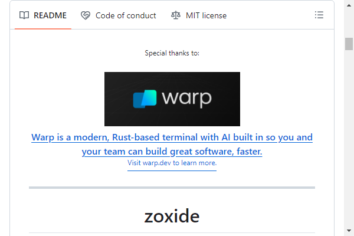
    </a>

??? example "[alichtman/shallow-backup](https://github.com/alichtman/shallow-backup#readme) Clear description of what the project does. GIF Demo. TOC for easy navigation. Badges. Links for further reading. Simple install instructions."
    <a href="https://github.com/alichtman/shallow-backup#readme">
    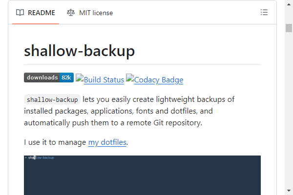
    </a>

??? example "[alichtman/stronghold](https://github.com/alichtman/stronghold#readme) Project logo. Clear description of what the project does. GIF Demo. TOC for easy navigation. Badges. Links for further reading. Simple install instructions."
    <a href="https://github.com/alichtman/stronghold#readme">
    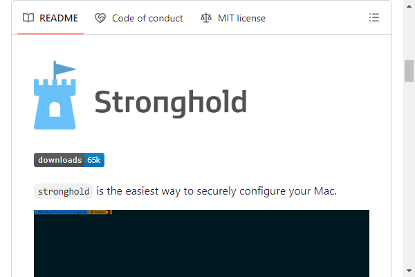
    </a>

??? example "[amitmerchant1990/electron-markdownify](https://github.com/amitmerchant1990/electron-markdownify#readme) Project logo. Minimalist description of what it is. GIF demo of the project. Key features. How to install guide. Credits."
    <a href="https://github.com/amitmerchant1990/electron-markdownify#readme">
    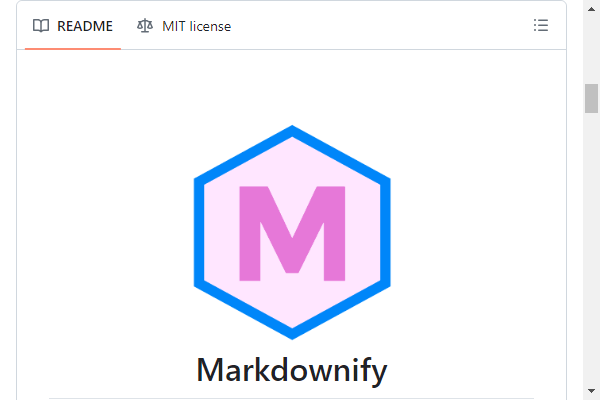
    </a>

??? example "[amplication/amplication](https://github.com/amplication/amplication#readme) Clear project logo. Brief explanation. All features explained. Clean documentation. Useful links (website, docs, discord). List of contributors with their pictures and usernames."
    <a href="https://github.com/amplication/amplication#readme">
    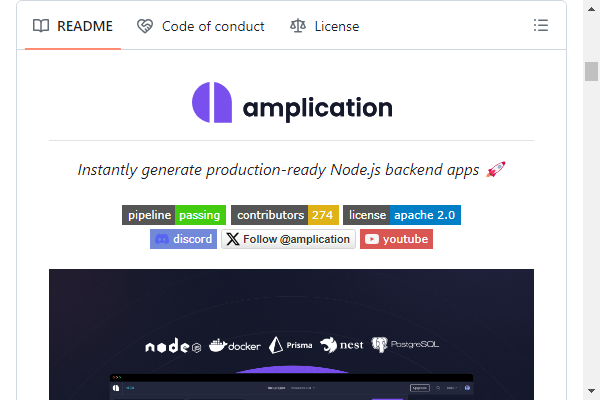
    </a>

??? example "[anfederico/Clairvoyant](https://github.com/anfederico/Clairvoyant#readme) Multiple badges. Clean logo. Simple install instructions. Clear overview of the project accompanied by a schematic. GIF demo. Extensive code examples."
    <a href="https://github.com/anfederico/Clairvoyant#readme">
    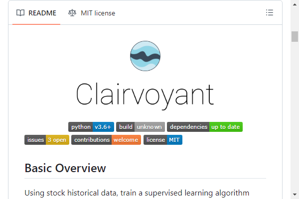
    </a>

??? example "[ankitwasankar/mftool-java](https://github.com/ankitwasankar/mftool-java#readme) Project logo with a short display of what can be achieved with it, TOC for easy navigation, important badges, clean installation guide, and multiple code snippets showing how to use the functionality."
    <a href="https://github.com/ankitwasankar/mftool-java#readme">
    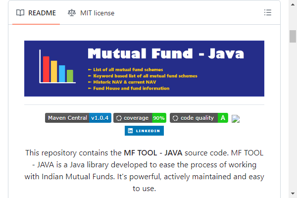
    </a>

??? example "[antoinezanardi/werewolves-assistant-api-next](https://github.com/antoinezanardi/werewolves-assistant-api-next#readme) Project logo. Badges. Concise description. TOC for easy navigation. Simple install instructions and various sections. Clean project with code coverage, CI, and many other features."
    

??? example "[AntonioFalcaoJr/EventualShop](https://github.com/AntonioFalcaoJr/EventualShop#readme) The project has a logo and well-defined sections such as: information about the project, the architectural solution, along with reference links such as articles, videos, and documentation. It explains how to run the project in different environments (development and production). It has documented load tests, it also describes which technologies are used, and it has diagrams for the archetype."
    

??? example "[aregtech/areg-sdk](https://github.com/aregtech/areg-sdk#readme) Logo. Multiple info and statistics badges. List of contributors and stargazers with pictures. TOC and "Back to top" links for easy navigation. Headlines with graphics. Topic hide/show menu. Project description and philosophy. Clone and integration instructions. Quick build with multiple tools. Tools configuration instructions. Reference to examples and Demo projects. Reference to use cases. References to guidance and Wiki pages. Links with badges to contact. Links with badges to share project in social network."
    

??? example "[Armync/Arminc-AutoExec](https://github.com/ArmynC/ArminC-AutoExec/#readme) Rich Markdown functions, modern layout, clear description and compliant with the recommended community standards."
    <a href="https://github.com/ArmynC/ArminC-AutoExec/#readme">
    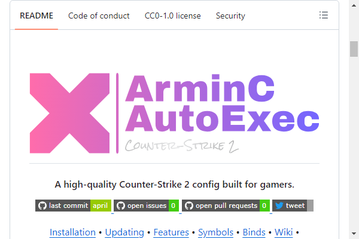
    </a>

??? example "[athityakumar/colorls](https://github.com/athityakumar/colorls#readme) Multiple badges. Clean screenshots. Simple install instructions. TOC for easy navigation. Good contributor guidelines."
    <a href="https://github.com/athityakumar/colorls#readme">
    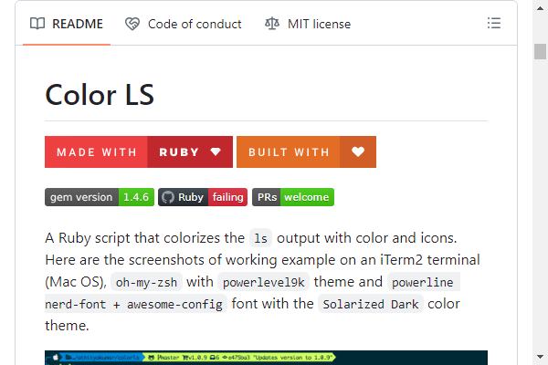
    </a>

??? example "[ccostan/Home-AssistantConfig](https://github.com/CCOSTAN/Home-AssistantConfig#readme) Project Banner. Badges. Easy navigation."
    

??? example "[choojs/choo](https://github.com/choojs/choo#readme) Badges, clean, clear. Beautiful little menu above the fold with useful links. An FAQ inside of it for the main questions. Backers. Good language."
    

??? example "[chroline/well_app](https://github.com/chroline/well_app#readme) Features attention-grabbing project thumbnail with clean badges, as well as download information and quick navigation links. Organized into multiple descriptive sections, each of which have a title with a yellow emoji. Includes details about the project itself, as well as the technologies used and how to contribute."
    <a href="https://github.com/chroline/well_app#readme">
    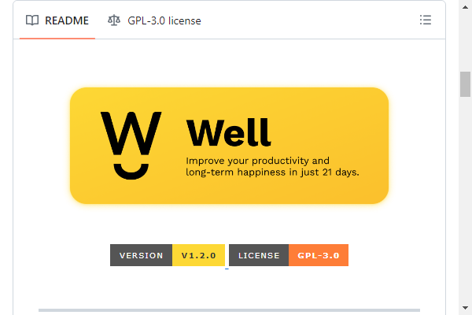
    </a>

??? example "[create-go-app/cli](https://github.com/create-go-app/cli#readme) Clean project logo. Useful badges (version, code style, test cover, docs). Clear readme with quickstart, understandable installation and usage manual, video screencast, ToC with well-documented project features (with a demo recording of the work in the terminal), project philosophy notes ("the why another"), most frequently asked questions, and more."
    <a href="https://github.com/create-go-app/cli#readme">
    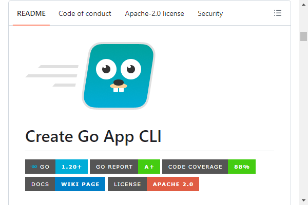
    </a>

??? example "[Day8/re-frame](https://github.com/Day8/re-frame#readme) Badges, logo, TOC, etc. Stands out by being a giant, well-written essay about the tech, how to use it, the philosophy behind it, and how it fits into the greater ecosystem."
    <a href="https://github.com/Day8/re-frame#readme">
    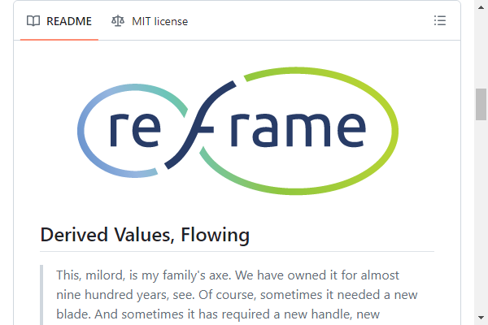
    </a>

??? example "[dbt-labs/dbt-core](https://github.com/dbt-labs/dbt-core#readme) Project banner, super clear description (friendly to people brand new to the product), screenshot of the docs the tool generates, and concise links to other comprehensive pages explaining Getting Started, Joining the dbt Community, Bug Reports, Code Contribution, and Code of Conduct"
    

??? example "[dowjones/react-dropdown-tree-select](https://github.com/dowjones/react-dropdown-tree-select#readme) Clear readme with GIF screenshot for quick demo. Multiple badges, concise ToC, online playground, storybook, detailed description and more."
    <a href="https://github.com/dowjones/react-dropdown-tree-select#readme">
    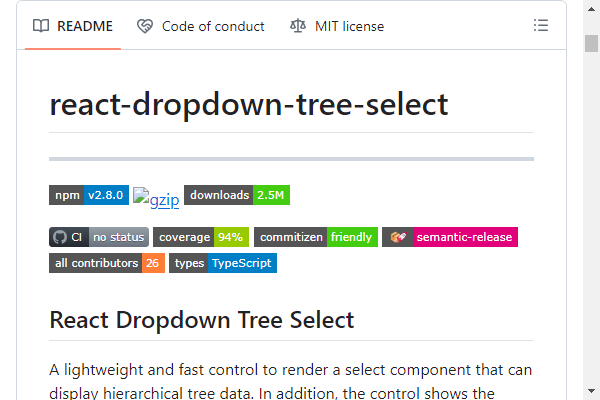
    </a>

??? example "[easybase/easybase-react](https://github.com/easybase/easybase-react#readme) Project banner and logo. Badges. Expandable walkthrough sections. Concise description and purpose. TOC for easy navigation. GIFs for installation demo. Multiple informative visuals."
    <a href="https://github.com/easybase/easybase-react#readme">
    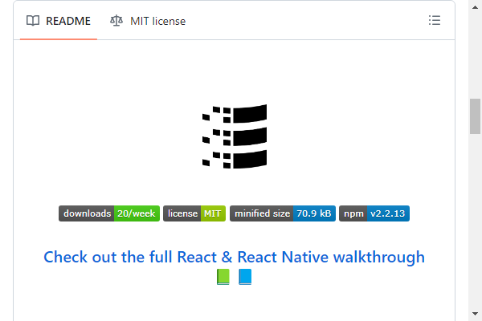
    </a>

??? example "[emalderson/thephish](https://github.com/emalderson/ThePhish#readme) Project logo, informative badges, useful TOC, clear description, screenshots, step-by-step installation and configuration guide, contributor guidelines, code of conduct, UML diagrams, coherent tags, issue and pull request templates, well-documented and well-commented code, examples."
    <a href="https://github.com/emalderson/ThePhish#readme">
    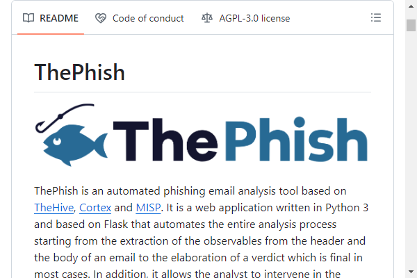
    </a>

??? example "[github-changelog-generator/github-changelog-generator](https://github.com/github-changelog-generator/github-changelog-generator#readme) TOC for easy navigation. Concise project description. Installation and usage sections. Output example. Great feature overview. List of alternatives. FAQ."
    <a href="https://github.com/github-changelog-generator/github-changelog-generator#readme">
    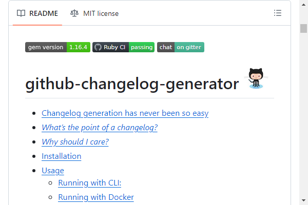
    </a>

??? example "[gitpoint/git-point](https://github.com/gitpoint/git-point#readme) Clear description. Project Logo. App Store logos. TOC. Clean screenshots. List of features. Detailed installation process. Landing Page."
    

??? example "[gofiber/fiber](https://github.com/gofiber/fiber#readme) Clean project logo. Useful badges and links (languages switcher, code style, test cover, docs, Discord channel). Clear description of what the project does with quickstart, benchmark charts, well-documented code examples (with the ability to hide long content), project philosophy notes ("the why of project"), tables with project addons, list of contributors, star growth statistics, and more."
    

??? example "[gowebly/gowebly](https://github.com/gowebly/gowebly#readme) Clean project banner with logo. Useful badges and links (languages switcher, test cover, docs). Clear description of what the project does with quickstart, understandable feature list, links to the introduction video and article, well-documented CLI command examples, project philosophy notes ("motivation to create"), tables with project components, links to addons and helpers, list of stargazers, and more."
    

??? example "[Hexworks/Zircon](https://github.com/Hexworks/zircon#readme) Dogfood in readme. Clear description of what the project does. Demo screenshot. TOC for easy navigation. Easy installation and setup sections with screenshots. Links for further reading."
    <a href="https://github.com/Hexworks/zircon#readme">
    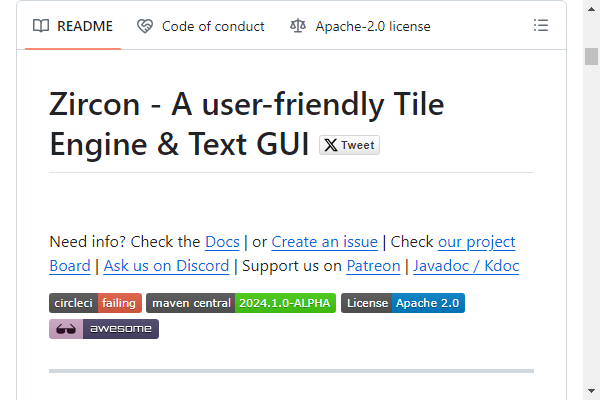
    </a>

??? example "[httpie/httpie](https://github.com/httpie/httpie#readme) Description of what the project does. Demo screenshots. Project logo. TOC for easy navigation. Build badges. Quick and simple installation and usage sections. Includes an examples section."
    

??? example "[hywax/mafl](https://github.com/hywax/mafl#readme) Project logo. Clear description of what the project does. TOC for easy navigation. Usage code samples."
    

??? example "[IgorAntun/node-chat](https://github.com/IgorAntun/node-chat#readme) Project screenshot. Informative badges. Clear description. Easy installation/use instructions. Live demo."
    <a href="https://github.com/IgorAntun/node-chat#readme">
    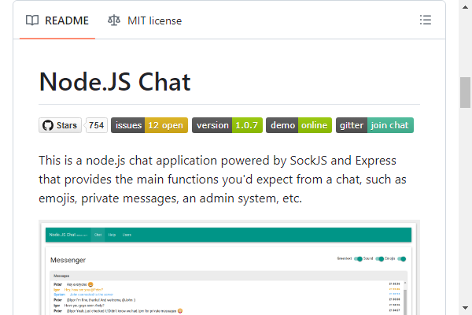
    </a>

??? example "[iharsh234/WebApp](https://github.com/iharsh234/WebApp#readme) Project landing page. Clear description of what the project does. Demo screenshot. Simple install and usage sections. Includes an examples section with common uses and a mobile demo section."
    <a href="https://github.com/iharsh234/WebApp#readme">
    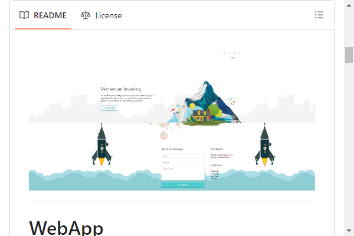
    </a>

??? example "[iterative/dvc](https://github.com/iterative/dvc#readme) ReStructuredText format example, PyPi compatible. Logo, custom website-like menu. Smooth how-it-works animation. Badges. Nice contribution section with the hall-of-fame."
    

??? example "[ivanperez-keera/Yampa](https://github.com/ivanperez-keera/Yampa#readme) Clear description. Feature list. TOC for easy navigation. Simple install instructions. Usage code samples. Project samples with GIFs and links to app stores. Documentation and publications. Clear development / contribution rules."
    

??? example "[karan/joe](https://github.com/karan/joe#readme) Project logo. Clear description of what the project does. GIF demo. Easy install and usage sections."
    <a href="https://github.com/karan/joe#readme">
    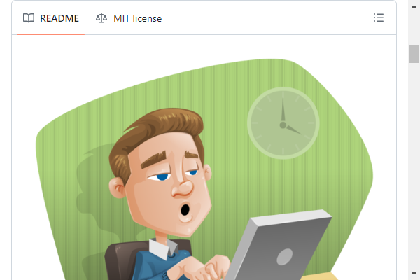
    </a>

??? example "[kopach/karma-sabarivka-reporter](https://github.com/kopach/karma-sabarivka-reporter#readme) Project logo. Useful badges, clear readme with screenshots for quick demo. Concise ToC."
    

??? example "[L0garithmic/FastColabCopy](https://github.com/L0garithmic/FastColabCopy#readme) Project logo. Minimalist description. Badges. GIF demo. About The Project. How To Use. Examples. Credits. Additional Examples."
    

??? example "[ma-shamshiri/Human-Activity-Recognition](https://github.com/ma-shamshiri/Human-Activity-Recognition#readme) Beautiful table of contents. Project logo. Animated project banner. Complete project folder structure. Clear description of what the project does. Nice contributors’ section. Easy navigation."
    <a href="https://github.com/ma-shamshiri/Human-Activity-Recognition#readme">
    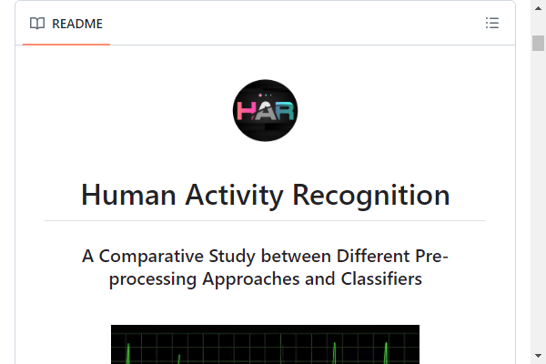
    </a>

??? example "[ma-shamshiri/Pacman-Game](https://github.com/ma-shamshiri/Pacman-Game#readme) Beautiful table of contents. Project logo. Animated project banner. Suitable GIFs to display each part of the project. Complete list of project files in the repo along with their function. Complete execution instruction."
    

??? example "[ma-shamshiri/Spam-Detector](https://github.com/ma-shamshiri/Spam-Detector#readme) Complete project file description. Project logo. Animated project banner. Concise project description. Clear execution instruction."
    

??? example "[MananTank/radioactive-state](https://github.com/MananTank/radioactive-state#readme) Badges (version, downloads, coverage, size), Twitter Intent, Project Logo, Feature list, Motivation, Installation, Example with GIFs, Emojis, Collapsible Sections, Live Demos, API detailed usage, FAQs, Chat link."
    

??? example "[Martinsos/edlib](https://github.com/Martinsos/edlib#readme) Informative badges (build, version, publication). Concise description. Feature list. TOC. Screenshots. Concise instructions with examples for building and including in your project. Common code examples to get you started quickly."
    <a href="https://github.com/Martinsos/edlib#readme">
    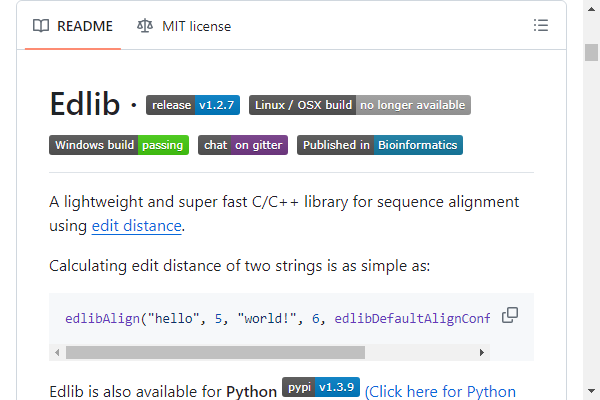
    </a>

??? example "[NASA/ogma](https://github.com/NASA/ogma#readme) Clear description. Feature list. Demo GIFs. Simple install instructions. Usage code samples. TOC for easy navigation."
    <a href="https://github.com/NASA/ogma#readme">
    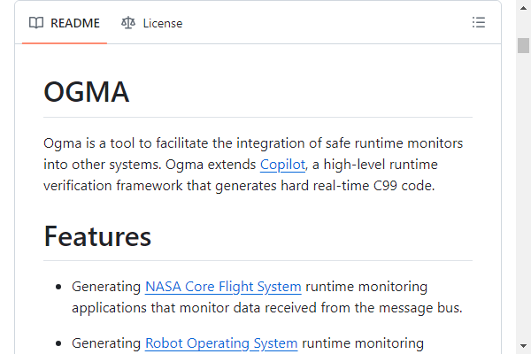
    </a>

??? example "[nhn/tui.editor](https://github.com/nhn/tui.editor#readme) Project logo. Clear overview of project features with a demo GIF. Badges. TOC for easy navigation. Colorful icons in front of titles."
    

??? example "[NSRare/NSGIF](https://github.com/NSRare/NSGIF#readme) Project logo. GIF Demo. Usage artwork. Usage code samples."
    <a href="https://github.com/NSRare/NSGIF#readme">
    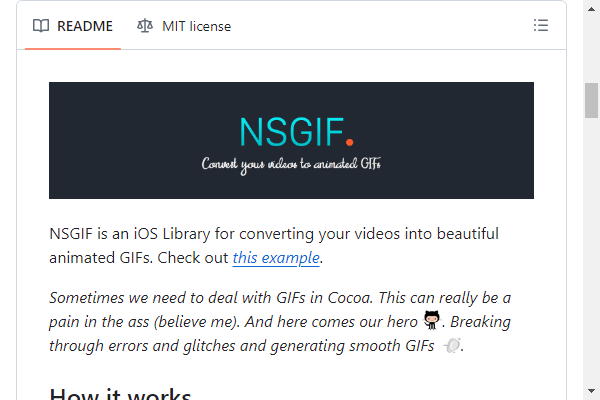
    </a>

??? example "[Owloops/updo](https://github.com/owloops/updo#readme) Well-structured, visually appealing, and provides comprehensive information about the tool, from its purpose and features to installation and usage, in a clear and user-friendly manner."
    

??? example "[php-censor/php-censor](https://github.com/php-censor/php-censor#readme) Multiple badges, project logo, screenshots, step-by-step installing and upgrading instructions, TOC for easy navigation."
    

??? example "[PostHog/posthog](https://github.com/PostHog/posthog#readme) Custom-made section icons, demo GIF, deploy button, profile images for contributors, concise, clear structure, project logo."
    

??? example "[priyavrat-misra/xrays-and-gradcam](https://github.com/priyavrat-misra/xrays-and-gradcam#readme) TOC for easy navigation. Clear introduction of what the project does. Complete list of all files in the repo and what their function is. Usage section. Clean and concise tables."
    <a href="https://github.com/priyavrat-misra/xrays-and-gradcam#readme">
    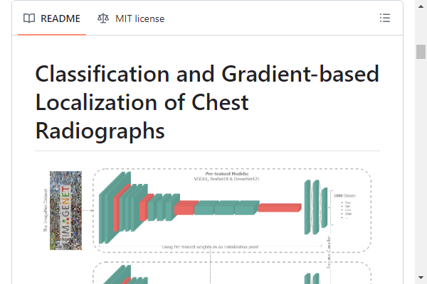
    </a>

??? example "[React on lambda](https://github.com/sultan99/react-on-lambda#readme) Project logo, comics to present the main idea, badges, examples with code snippets, demo projects, api documentations, editor configurations."
    <a href="https://github.com/sultan99/react-on-lambda#readme">
    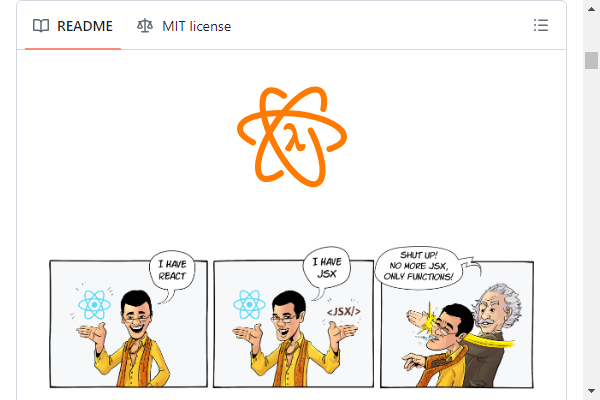
    </a>

??? example "[React Parallax Tilt](https://github.com/mkosir/react-parallax-tilt#readme) GIF demo. Multiple badges. Feature list. Great live demo with code examples. Easy to follow instructions for local development set up."
    

??? example "[Rebilly/redoc](https://github.com/Redocly/redoc#readme) Multiple badges, project logo, live demo link, GIF-animations of the key features, TL;DR usage."
    <a href="https://github.com/Redocly/redoc#readme">
    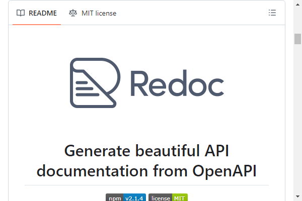
    </a>

??? example "[refinedev/refine](https://github.com/refinedev/refine#readme) Clean project logo. Brief description at top. Multiple badges. Usage description and examples. Use cases and demo links. Screenshots. Key Features. Contributors. Stargazers. Contribution guidelines."
    <a href="https://github.com/refinedev/refine#readme">
    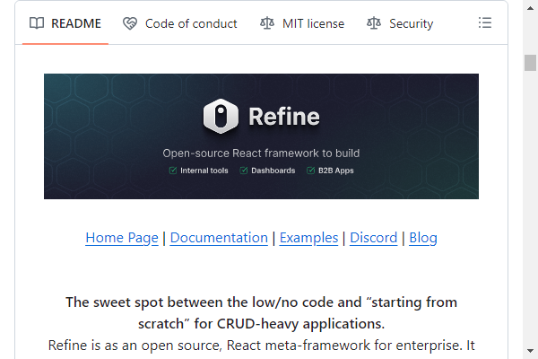
    </a>

??? example "[release-it/release-it](https://github.com/release-it/release-it#readme) Clear overview of project features with a demo GIF. Badges. Expandable TOC. Usage description and examples. Contribution guidelines. Detailed releases."
    

??? example "[rstacruz/hicat](https://github.com/rstacruz/hicat#readme) GIF demo. Easy installation and setup sections with screenshots. Build badges. Great examples of use cases."
    <a href="https://github.com/rstacruz/hicat#readme">
    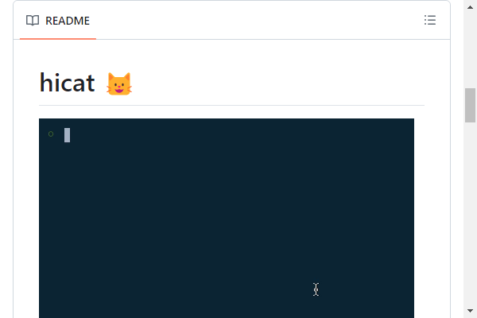
    </a>

??? example "[ryanoasis/nerd-fonts](https://github.com/ryanoasis/nerd-fonts#readme) Clean project logo. Brief description at top. Sankey diagram, quick links, badges, OS specific icons, TOC, detailed release changelog."
    <a href="https://github.com/ryanoasis/nerd-fonts#readme">
    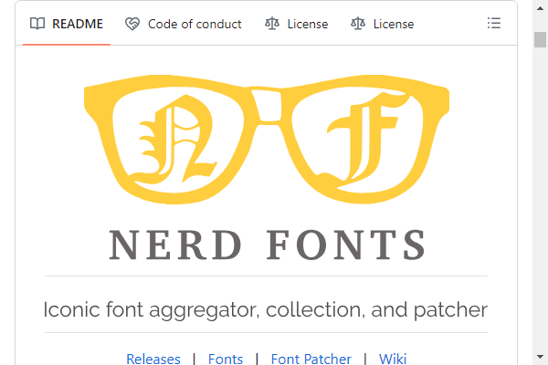
    </a>

??? example "[sebyddd/SDVersion](https://github.com/sebyddd/SDVersion#readme) Project logo. Build badges. Documentation structuring for multiple programming languages. Usage examples."
    

??? example "[serpro69/kotlin-faker](https://github.com/serpro69/kotlin-faker#readme) Project logo. Badges. Concise description and clear getting-started instructions with a link to the full documentation website. Test, build and contributing guidelines. Licence info."
    

??? example "[shama/gaze](https://github.com/shama/gaze#readme) Project logo. Concise description. Feature list. Usage section. FAQ. Great API documentation. Release history."
    <a href="https://github.com/shama/gaze#readme">
    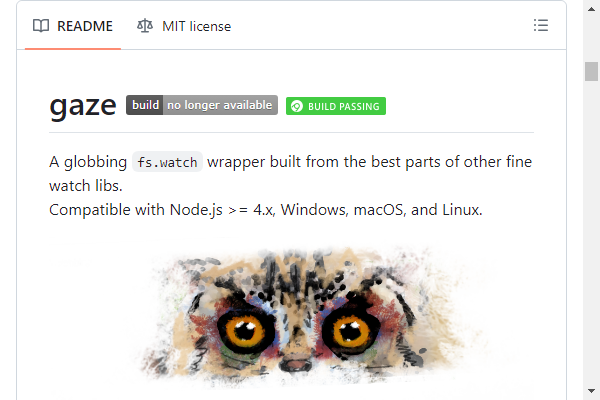
    </a>

??? example "[sidneycadot/oeis](https://github.com/sidneycadot/oeis#readme) Overview. List of required dependencies. Complete list of all files in the repo and what their function is. Visual graph of how it all ties together."
    

??? example "[sindresorhus/pageres](https://github.com/sindresorhus/pageres#readme) Project logo. Clear description of what the project does. Build badges. Demo screenshot. Simple install and usage sections. Includes an examples section with common uses."
    <a href="https://github.com/sindresorhus/pageres#readme">
    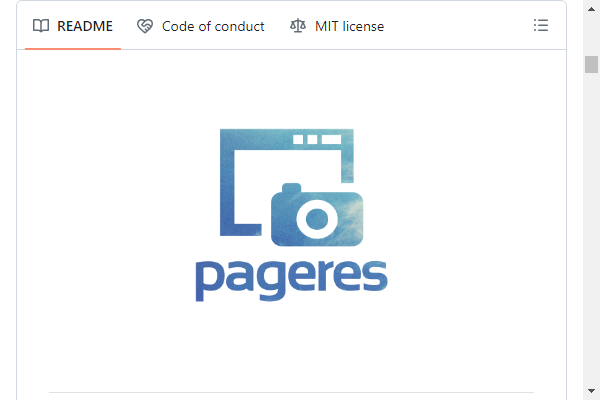
    </a>

??? example "[skydio/revup](https://github.com/Skydio/revup#readme) Project logo. Animated GIF demo + GIFs for major stages of the step-by-step tutorial. Concise explanation, installation instructions, and contribution section."
    <a href="https://github.com/Skydio/revup#readme">
    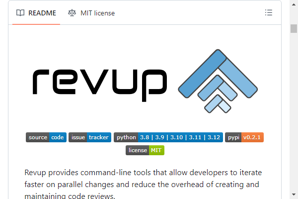
    </a>

??? example "[Slackadays/Clipboard](https://github.com/Slackadays/Clipboard#readme) Project logo. Build and test/coverage badges. Transition from plain description to people-oriented description. Animated GIF showing usage. Custom banners for clearly laid out sections. Custom text assets for headers. Immediate call to action with Quick Start section. Consistent and easy to read command names and signatures. Three immediate options for getting help provided. Easter eggs provided for the detail-oriented."
    

??? example "[sourcerer-io/sourcerer-app](https://github.com/sourcerer-io/sourcerer-app#readme) Clean animated screenshot. Customized call to action badge. Usage showcase."
    

??? example "[sr6033/lterm](https://github.com/sr6033/lterm#readme) Clean logo using characters. Brief updates on development. Detailed contribution guidelines. Contribution suggestions."
    

??? example "[Stack-in-a-box/triumphmayflowerclub.com](https://github.com/Stack-in-a-box/triumphmayflowerclub.com#readme) Stands-out because, while only a simple website, it is presented as a very open project for lesser-experienced developers to cut their teeth on, with a friendly, inclusive tone and accessible set-up instructions. Includes many common elements found in other beautiful READMEs."
    

??? example "[sulu/sulu](https://github.com/sulu/sulu#readme) Project logo, useful badges, clear instructions on where to find more information and report bugs, GIF screenshots, nice use of emoticons."
    <a href="https://github.com/sulu/sulu#readme">
    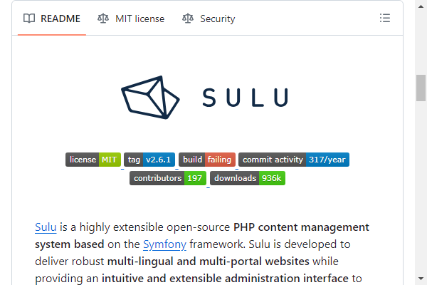
    </a>

??? example "[supunlakmal/thismypc](https://github.com/supunlakmal/thismypc#readme) Project logo. Useful badges. Web site URL. Screenshot. GIF step-by-step instructions for installation. Project folder structure."
    

??? example "[teles/array-mixer](https://github.com/teles/array-mixer#readme) Clean project logo, badges. Table of contents. Contributing section. Many illustrated examples."
    <a href="https://github.com/teles/array-mixer#readme">
    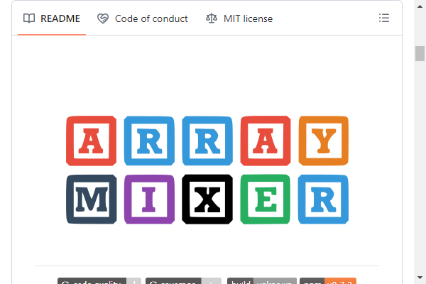
    </a>

??? example "[thelounge/thelounge](https://github.com/thelounge/thelounge#readme) Project logo. Useful badges and links (website, docs, demo). Screenshot. Feature list. Step-by-step instructions for installation, development, and testing. Link to the contributing guide. Good mobile summary."
    

??? example "[themerdev/themer](https://github.com/themerdev/themer#readme) Project logo. Visual description (flowchart) of what the project does. Build badges. TOC. Demo screenshot. Concise install and usage sections, including common workflows. Colorful previews."
    

??? example "[vhesener/Closures](https://github.com/vhesener/Closures#readme) Project logo, cognitive funnel, animated examples. Color coordinated. Clean documentation."
    

??? example "[xnbox/DeepfakeHTTP](https://github.com/xnbox/DeepfakeHTTP#readme) Original hero section. Clear navigation. Minimalist design. Appendices."
    

??? example "[zenml-io/zenml](https://github.com/zenml-io/zenml#readme) Clean project logo. Useful TOC. Clear code examples amongst feature list. Quickstart example."
    <a href="https://github.com/zenml-io/zenml#readme">
    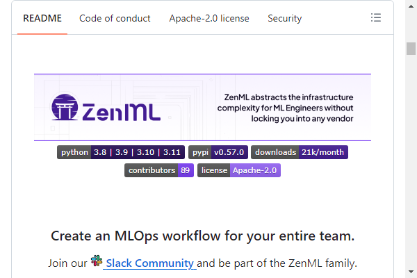
    </a>
