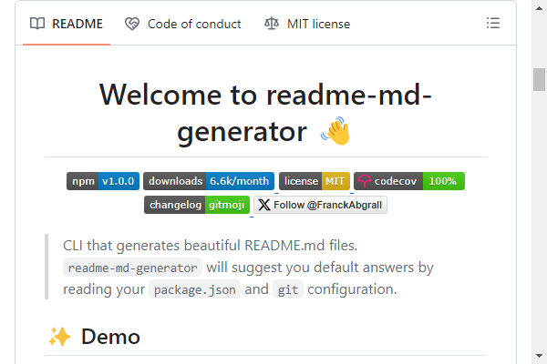

---
hide:
  - navigation
  - toc
---

# Tools

??? example "[Common Readme](https://github.com/hackergrrl/common-readme#readme)  A common readme style for Node. Includes a guide and a readme generator."
    

??? example "[Feedmereadmes](https://github.com/lappleapple/feedmereadmes#readme)  README editing and project analysis/feedback."
    

??? example "[GitHub Readme Stats](https://github.com/anuraghazra/github-readme-stats#readme)  Dynamically generated customizable GitHub cards for README. Stats, extra pins, top languages and WakaTime."
    

??? example "[Hall-of-fame](https://github.com/sourcerer-io/hall-of-fame#readme)  Helps show recognition to repo contributors on README. Features new/trending/top contributors. Updates every hour."
    

??? example "[Make a README](https://www.makeareadme.com/)  A guide to writing READMEs. Includes an editable template with live Markdown rendering."
    

??? example "[README best practices](https://github.com/jehna/readme-best-practices#readme)  A place to copy-paste your README.md from"
    

??? example "[readme-md-generator](https://github.com/kefranabg/readme-md-generator#readme)  A CLI that generates beautiful README.md files"
    

??? example "[Readme.so](https://readme.so/)  A simple editor that allows you to quickly add and customize all the sections you need for your project's readme."
    

??? example "[READMINE](https://github.com/mhucka/readmine)  A thorough, clear and self-describing README file template for software projects; copy it and edit it as needed."
    

??? example "[StackEdit](https://stackedit.io/)  A user-friendly online editor that allows you to quickly customize all the sections you need for your project's readme."
    

??? example "[Standard Readme](https://github.com/RichardLitt/standard-readme#readme)  A standard README style specification. Has a generator to help create spec-compliant READMEs, too."
    

??? example "[user-statistician](https://github.com/cicirello/user-statistician)  A GitHub Action that generates SVG of detailed GitHub user activity for profile readmes."
    

??? example "[Zalando's README Template](https://github.com/zalando/zalando-howto-open-source/blob/master/READMEtemplate.md#readme)  Simple template to help you cover all the basics."
    
